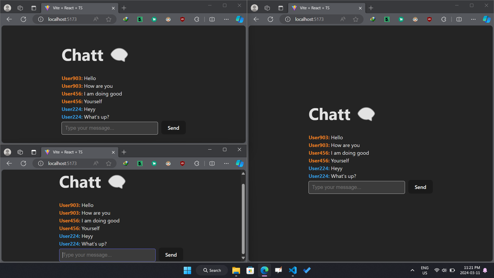

# Realtime Chat



# Architecture Overview

The application follows a client-server architecture with a focus on realtime communication using WebSockets through the Socket.IO library. Here's a breakdown of the main components:

## Server-side (Express)

Express Server: The core server is created using Express, a minimal and flexible Node.js web application framework.

## Socket.IO Integration:

Socket.IO is utilized to enable bidirectional communication between the server and clients in real time.

## Error Handling:

Express middleware is implemented to handle server-side errors gracefully, ensuring a smooth user experience.

## Realtime Communication (Socket.IO)

Socket Handler: The socketHandler module manages Socket.IO events, such as user connections, disconnections, and message broadcasting.
Connected Users: A connectedUsers map is used to keep track of users by their unique Socket.IO IDs, along with associated usernames and colors.
Client-side (Not Included)
The client-side implementation (HTML, CSS, JavaScript/TypeScript) is not included in this repository but is expected to establish a WebSocket connection with the server to send and receive messages.

## Concurrency Handling

User Connections: When a user connects, a unique username and color are assigned, and the user is added to the connectedUsers map. A "user-connected" event is broadcasted to inform other clients.

## Message Broadcasting:

Messages are broadcasted to all connected users, ensuring a synchronized and concurrent chat experience. Each message includes the sender's username and color.
User Disconnections: When a user disconnects, their information is removed from the connectedUsers map, and a "user-disconnected" event is broadcasted.

# How To Use

## Clone the Repository

Clone the repository using

```
git clone https://github.com/abdullahalam123/user-chat.git.****
```

The repository contains two folders for the client and server components.

## Client

1. Navigate to the `client` folder:

   ```bash
   cd client
   ```

2. Install dependencies:

   ```bash
   npm install
   ```

3. Run the development server:

   ```bash
   npm run dev
   ```

   Your client server will be available at [http://localhost:5173/](http://localhost:5173/).

## Server

1. Navigate to the `server` folder:

   ```bash
   cd server
   ```

2. Install dependencies:

   ```bash
   npm install
   ```

3. Run the server in development mode:

   ```bash
   npm run dev
   ```

   Your server will be available at [http://localhost:5000](http://localhost:5000).
